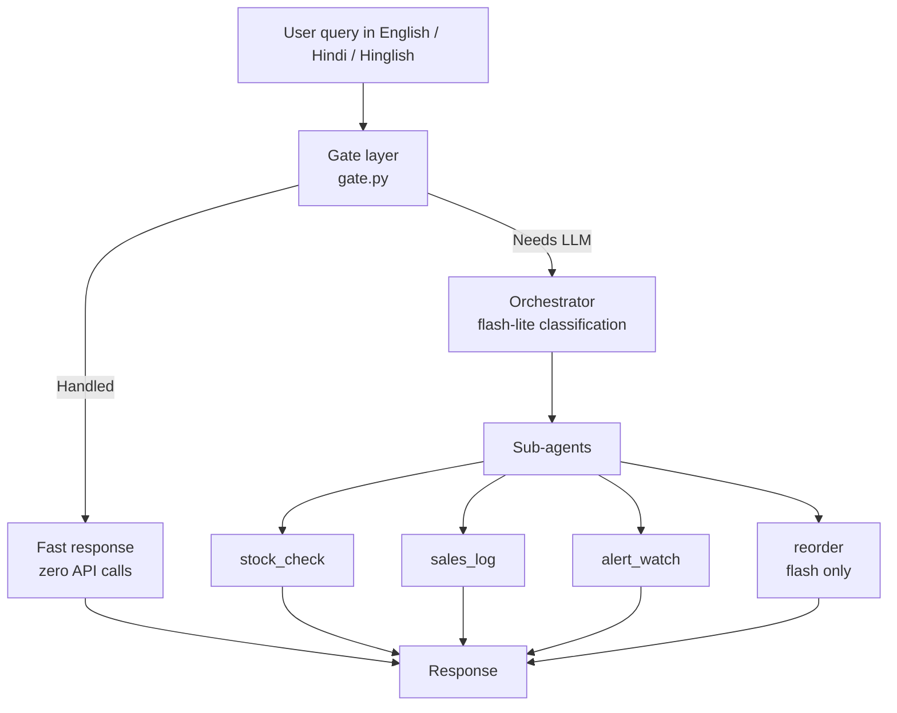

# ShelfSense 🏪

ShelfSense is a token-efficient, multi-agent AI inventory concierge for Indian kirana shops. It supports English, Hindi, and mixed Hinglish queries, routes simple requests through a zero-API gate layer, and uses Gemini only when a query needs classification or reorder planning.

## What it does

ShelfSense handles common shop-owner tasks like checking stock, logging sales, scanning for alerts, and generating reorder suggestions.

| Example query | Result | API call |
|---|---|---|
| `dahi kitna bacha hai?` | Returns current curd stock | No |
| `bread ke 5 packet bik gaye` | Logs a sale and updates inventory | No |
| `kya koi item low stock hai?` | Returns low-stock and expiry alerts | No |
| `is week kya reorder karna chahiye?` | Generates an AI reorder plan | Yes, Gemini Flash |
| `paneer aur doodh ka stock batao` | Classifies intent and checks stock | Usually no, sometimes Flash-Lite |

## Architecture



The pipeline is intentionally small and cost-aware:

- The gate layer normalises Hinglish, matches intents, and resolves products locally.
- `gemini-2.5-flash-lite` is used only for intent classification when the gate cannot answer.
- `gemini-2.5-flash` is used only for reorder planning.
- History is trimmed to the last 2 turns and outputs are constrained to JSON schemas.

## Repository layout

```text
app.py                         Streamlit entry point
requirements.txt               Python dependencies
.env.example                   Gemini API key template
data/seed_inventory.py         Seeds sample inventory and alerts
shelfsense/config.py           Central configuration
shelfsense/database.py         SQLite helpers
shelfsense/gate.py             Zero-API intent and product routing
shelfsense/orchestrator.py     Gemini classifier and dispatcher
shelfsense/models.py           Pydantic schemas
shelfsense/agents/             Stock, sales, alert, and reorder agents
notebook/ShelfSense_Kaggle.ipynb  Kaggle submission notebook
```

## Requirements

- Python 3.10+ recommended
- A Gemini API key for the LLM-backed paths
- Streamlit for the UI

## Setup

### 1. Create a virtual environment

Windows PowerShell:

```powershell
python -m venv .venv
.\.venv\Scripts\Activate.ps1
```

macOS / Linux:

```bash
python3 -m venv .venv
source .venv/bin/activate
```

### 2. Install dependencies

```bash
pip install -r requirements.txt
```

### 3. Configure environment variables

Copy the example file to `.env` and add your Gemini API key.

Windows PowerShell:

```powershell
Copy-Item .env.example .env
```

macOS / Linux:

```bash
cp .env.example .env
```

Get a key from [Google AI Studio](https://aistudio.google.com/apikey) and set:

```env
GEMINI_API_KEY=your_key_here
```

### 4. Seed the database

```bash
python data/seed_inventory.py
```

This creates the SQLite database and loads 30 sample products, suppliers, and demo alerts.

### 5. Run the app

```bash
streamlit run app.py
```

If your shell cannot find Streamlit, use the project venv directly:

```bash
.\.venv\Scripts\python.exe -m streamlit run app.py
```

## Demo queries

- `dahi kitna bacha hai?`
- `bread ke 5 packet bik gaye`
- `kya koi item low stock hai?`
- `expiry alerts dikhao`
- `is week kya reorder karna chahiye?`
- `paneer aur doodh ka stock batao`

## Notes

- The app is designed to avoid unnecessary Gemini calls.
- Inventory data lives in `data/inventory.db` and is recreated by the seed script.
- If you want a clean demo state, re-run the seed script or use the sidebar controls in the app.

## Deployment

The project is ready for Streamlit Community Cloud or any environment that can install the dependencies, provide `GEMINI_API_KEY`, and run `streamlit run app.py`.

## License

MIT
